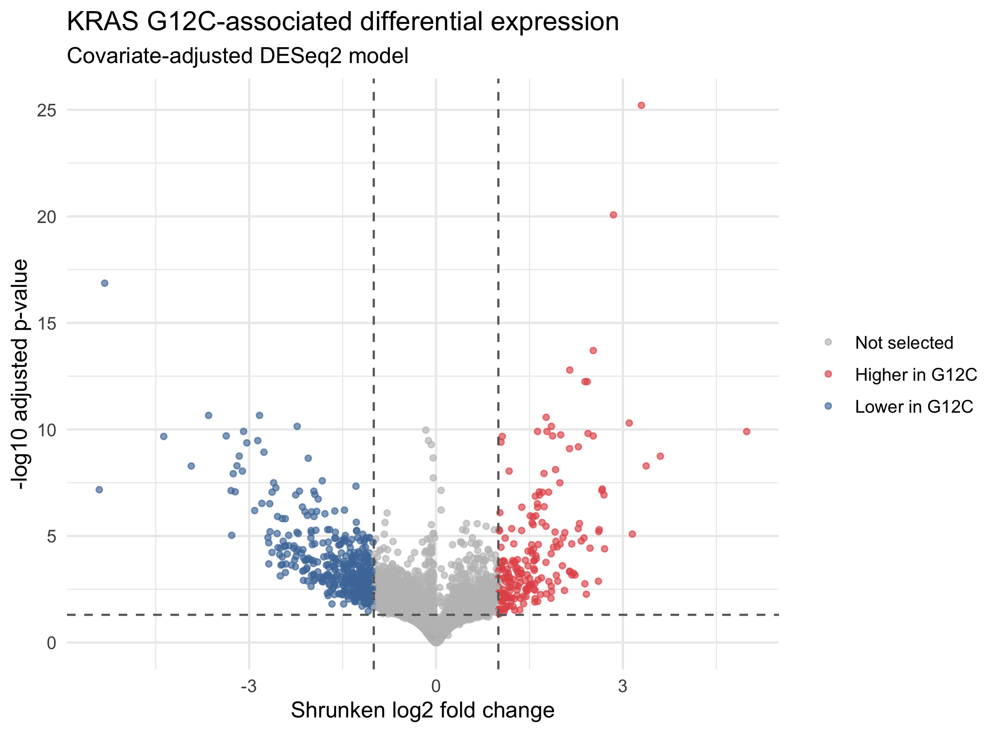
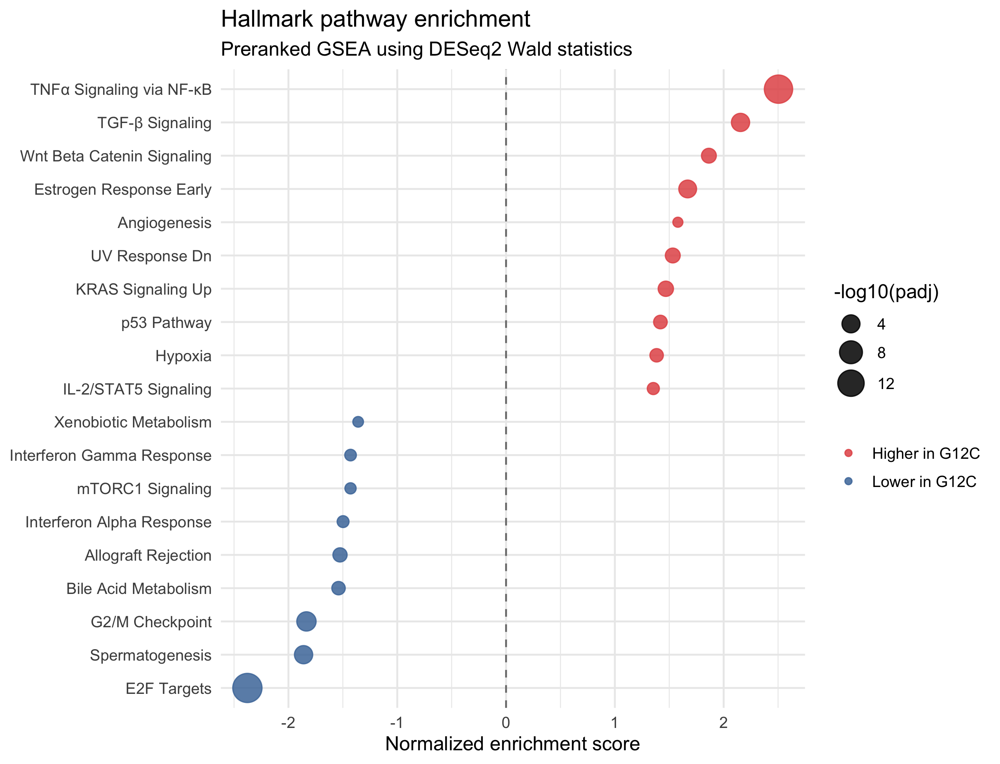
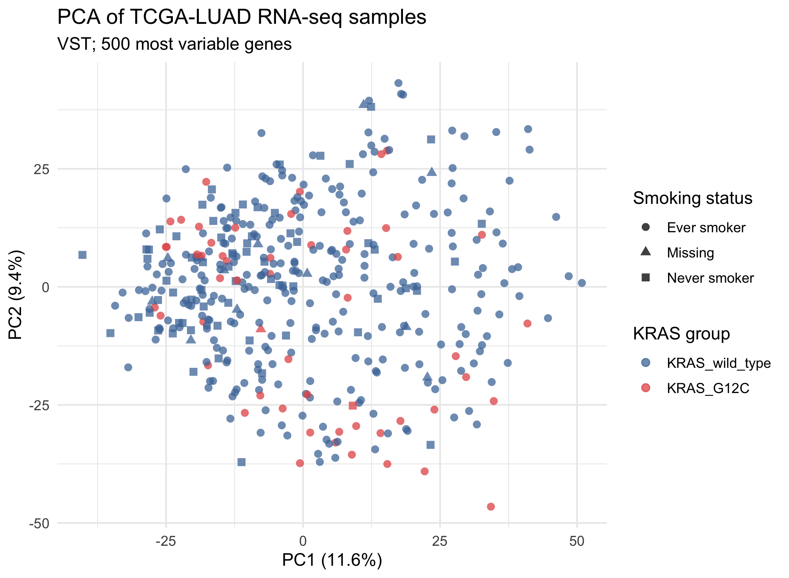

# KRAS G12C-associated expression in TCGA-LUAD

This learning-focused portfolio project examines gene-expression differences
between primary TCGA lung adenocarcinomas with **KRAS G12C** and tumors with no
protein-altering KRAS variant in the GDC masked mutation data.

The analysis uses public GDC STAR gene-level raw counts. Results are
associations from an observational bulk RNA-seq cohort and should not be
interpreted as causal or clinically validated effects of KRAS G12C.

## Analysis outline

1. Query TCGA-LUAD RNA-seq, masked mutation, and clinical metadata.
2. Define KRAS G12C and KRAS wild-type participants.
3. Select one primary-tumor RNA-seq aliquot per participant.
4. Assess sample-level QC and global expression patterns.
5. Fit a covariate-adjusted DESeq2 model and two sensitivity models.
6. Run preranked Hallmark GSEA using DESeq2 Wald statistics.

The primary model is:

```text
~ age + sex + pathologic stage + smoking status + KRAS group
```

Age is taken from `age_at_index`, with `age_at_diagnosis` used when the former
is unavailable. Other protein-altering KRAS-mutant tumors are excluded from the
primary comparison.

## Cohort

| Group | Participants |
|:--|--:|
| KRAS G12C | 54 |
| KRAS wild-type | 367 |

The complete-case primary model includes 388 participants (52 KRAS G12C and
336 KRAS wild-type). When a participant has multiple RNA-seq aliquots, the
aliquot with the largest library size is retained to avoid pseudoreplication.

## Main results

Using an adjusted p-value below 0.05 and an absolute apeglm-shrunken log2 fold
change of at least 1, the primary model selected 651 genes: 205 higher and 446
lower in KRAS G12C tumors.



The ever-smoker-only analysis was highly concordant with the primary model
(Spearman correlation 0.985; 497 selected genes in common). Adjustment for
TP53, STK11, and KEAP1 co-mutations reduced the selected set to 325 genes,
while effect estimates remained correlated with the primary model (Spearman
correlation 0.882). Directions agreed for all selected genes shared with each
sensitivity model.

Hallmark GSEA identified 19 pathways with an adjusted p-value below 0.05. The
strongest signals included positive enrichment of TNF-alpha signaling via
NF-kappaB and negative enrichment of E2F targets. These pathway-level results
may reflect tumor-cell programs as well as smoking history, co-mutations, tumor
purity, and immune or stromal composition.



PCA did not show clear separation between the KRAS groups, indicating that KRAS
status is not the main source of global expression variation in this cohort.



## Important limitations

- Smoking status is strongly imbalanced between the groups. The primary model
  adjusts for smoking, and an ever-smoker-only analysis is included as a
  sensitivity analysis.
- KRAS wild-type tumors are molecularly heterogeneous and may carry other
  oncogenic drivers.
- TP53, STK11, and KEAP1 co-mutations are not included in the primary model;
  their influence is examined in a separate sensitivity model.
- Bulk RNA-seq measures mixtures of tumor, immune, and stromal cells. Tumor
  purity and cell-type composition are not modeled directly.
- The findings have not been validated in an independent cohort.

## Repository contents

```text
scripts/          Six numbered R scripts
metadata/         GDC file manifests and aliquot selection
results/figures/  PCA, differential-expression, and GSEA figures
results/tables/   Small summary and result tables
data/             Downloaded and intermediate files (not tracked by Git)
renv.lock         R package versions
```

## Reproducing the analysis

The project was developed with R 4.5.2 and Bioconductor 3.22. From the project
root, restore the R environment and run the scripts in order:

```bash
R -q -e 'renv::restore()'

for script in scripts/[0-9][0-9]_*.R; do
  Rscript "$script"
done
```

The download steps require network access and approximately 2 GB of local
storage. The tracked manifests record the GDC files used for the analysis.
